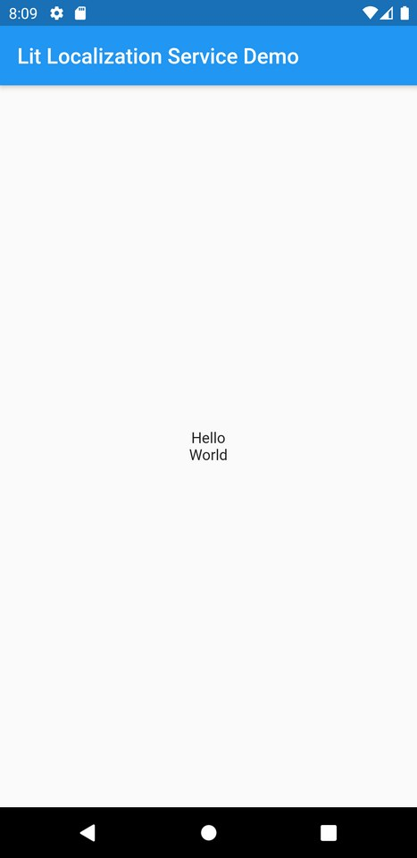
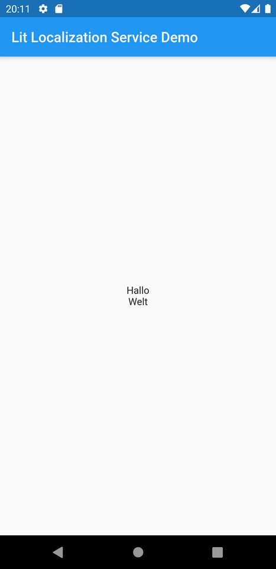

# Lit Localization Service

A Flutter package to create localizations using JSON files.

## Screenshots

| English Localization                                                                          | German Localization                                                                          |
| --------------------------------------------------------------------------------------------- | -------------------------------------------------------------------------------------------- |
|  |  |

## How it works

The JSON file is fetched on the localization delegate. Its content will then be extracted into a local `Map` and made accessible using the `BuildContext`. The localized strings can then be read by calling `LitLocalizations.of(context).getLocalizedValue("your_key_you_specified_on_the_json_file")` on the `build` method.

Reading essential values like texts from local storage will require a status check of the current fetch process on startup. This will increase the loading time of your application. It's used best when already depending on a persistent storage solution where loading processes on startup are required anyway.

## How to use

### Setup

- Provide a JSON file containing all localized strings in a predefined structure (Vide infra).
- Include the JSON file asset on your `pubspec.yaml` file of your app.

```yaml
assets:
  - assets/json/
```

- Include `lit_localization_service` as git dependency on your `pubspec.yaml` file of your app:

```yaml
lit_localization_service:
```

or as a pub dependency:

```yaml
lit_localization_service:
  git: https://github.com/litlifesoftware/lit_localization_service.git
```

- Set the `localizationsDelegates` property value of your `MaterialApp` by initializing the `LitLocalizationServiceDelegate`. Provide your JSON file's location.

```dart
  localizationsDelegates: [
    // The LitLocalizationServiceDelegate will be passed here.
    LitLocalizationServiceDelegate(
      // Set your asset url
      jsonAssetURL: 'assets/json/localized_strings.json',
      // Set all language code whose localization are available on the json file
      supportedLanguages: ['en', 'de'],
      // State whether to output logs.
      debug: true,
    ),
    GlobalMaterialLocalizations.delegate,
    GlobalWidgetsLocalizations.delegate,
    GlobalCupertinoLocalizations.delegate,
  ],
```

- Create a `FutureBuilder` to call the `initLocalizations` method in order to montitor the parsing state and conditionally returning either your screen containing your localized strings or a fallback/loading screen

```dart
class ParsingStateBuilder extends StatelessWidget {
  @override
  Widget build(BuildContext context) {
    return FutureBuilder(
      future: LitLocalizationController()
          .initLocalizations('assets/json/localized_strings.json'),
      builder: (context, localizatonsInitalization) {
        return localizatonsInitalization.connectionState ==
                ConnectionState.waiting
            ? LoadingScreen()
            : MyHomeScreen();
      },
    );
  }
}
```

- Call your localized strings by accessing the `BuildContext` once the parsing has been finished.

```dart
  Text(LitLocalizations.of(context).getLocalizedValue("hello")),
```

- This should display the string 'Hello' extracted from your JSON file as a Flutter `Text` widget.

### JSON file structure

The JSON file should contain a list of objects, whose keys can be arbitrary. Each of these objects will in turn have a list of key-value pairs, representing the language and the localized string `"languageCode": "Localized String"`.

```json
{
  "hello": {
    "en": "Hello",
    "de": "Hallo"
  },
  "world": {
    "en": "World",
    "de": "Welt"
  }
}
```

## Getting Started

This project is a starting point for a Dart
[package](https://flutter.dev/developing-packages/),
a library module containing code that can be shared easily across
multiple Flutter or Dart projects.

For help getting started with Flutter, view our
[online documentation](https://flutter.dev/docs), which offers tutorials,
samples, guidance on mobile development, and a full API reference.

## Example

The `example` folder contains an example app demonstrating the most basic implementation using a local JSON asset file.

## License

The source code of this repository is distributed under the
**BSD 3-Clause** license as specified in the `LICENSE` file.
